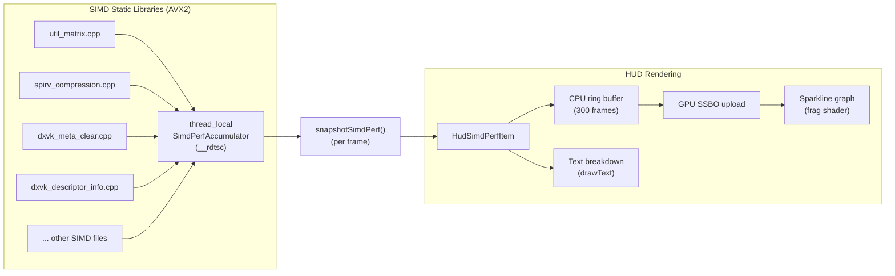

# SIMD Performance Graph in the DXVK HUD

Built-in cycle-level performance measurement of all AVX2-optimized hot paths, displayed as a live sparkline graph and zone-by-zone text breakdown in the DXVK HUD overlay. This feature is active only in experimental-SIMD builds.

---

## Core Architecture

The performance measurement system is designed for high accuracy and minimal overhead:

### 1. Timing Primitive
- We use the `__rdtsc()` intrinsic (~5–10 cycles per start/end pair) rather than `QueryPerformanceCounter` (~30–50 cycles).
- Ticks are converted to microseconds (`µs`) using a one-time calibration against the Query Performance Counter (QPC) during startup (`calibrateRdtscFrequency()`).

### 2. Thread-Local & Global Aggregation
- **Thread-Local Accumulator (`SimdPerfAccumulator`)**: Each thread tracks its accumulated cycles independently to eliminate thread contention.
- **Global Aggregator (`SimdPerfGlobalAccumulator`)**: Thread-local cycle counts are periodically flushed to global atomic variables via relaxed memory order writes (`std::memory_order_relaxed`).
- **Snapshot (`snapshotSimdPerf()`)**: Called once per frame on the main thread, resetting the global aggregators and returning the frame's total cycles per zone.

### 3. Rendering Pipeline
- **GPU Buffer & Pipeline**: The item is rendered using a dedicated graphics pipeline (`m_graphPipeline`) configured with vertex and fragment shaders. Push constants stage flags use `VK_SHADER_STAGE_VERTEX_BIT | VK_SHADER_STAGE_FRAGMENT_BIT`.
- **SSBO Ring Buffer**: The CPU-side ring buffer of 300 data points (representing SIMD execution time per frame in `µs`) is uploaded to a Vulkan host-visible GPU buffer.
- **HUD Placement**: The SIMD sparkline graph and zone breakdown render inline relative to the default DXVK HUD layout cursor at the top-left of the screen. Subsequent HUD items are dynamically pushed down to prevent overlapping.

---

## Architecture Diagram



---

## Measurement Zones & Instrumentation

We instrument AVX2-optimized hot paths under 8 distinct zones defined in the `SimdPerfZone` enum:

| Zone | Primary File | Instrumented Functions / Operations |
|---|---|---|
| `MatrixOps` | [util_matrix.cpp](file:///c:/Users/admin/Documents/GitHub/dxvk-Fallout4/src/util/util_matrix.cpp) | Matrix addition, multiplication, transpose, and inverse functions. |
| `SpirvDecompress` | [spirv_compression.cpp](file:///c:/Users/admin/Documents/GitHub/dxvk-Fallout4/src/spirv/spirv_compression.cpp) | SPIR-V shader decompression block. |
| `ImagePacking` | [dxvk_util.cpp](file:///c:/Users/admin/Documents/GitHub/dxvk-Fallout4/src/dxvk/dxvk_util.cpp) | Direct raw-to-Vulkan image packing functions. |
| `DescriptorOps` | [dxvk_descriptor_info.cpp](file:///c:/Users/admin/Documents/GitHub/dxvk-Fallout4/src/dxvk/dxvk_descriptor_info.cpp) | Nontemporal copy, nontemporal clear, and descriptor padding. |
| `ShaderOps` | [dxvk_shader_key.cpp](file:///c:/Users/admin/Documents/GitHub/dxvk-Fallout4/src/dxvk/dxvk_shader_key.cpp)<br>[dxvk_meta_clear.cpp](file:///c:/Users/admin/Documents/GitHub/dxvk-Fallout4/src/dxvk/dxvk_meta_clear.cpp)<br>[dxvk_shader_builtin.cpp](file:///c:/Users/admin/Documents/GitHub/dxvk-Fallout4/src/dxvk/dxvk_shader_builtin.cpp) | Key hashing/equality checking, workgroup size logic, and vector formatting. |
| `PipelineOps` | [dxvk_graphics.h](file:///c:/Users/admin/Documents/GitHub/dxvk-Fallout4/src/dxvk/dxvk_graphics.h)<br>[dxvk_constant_state.cpp](file:///c:/Users/admin/Documents/GitHub/dxvk-Fallout4/src/dxvk/dxvk_constant_state.cpp) | Graphics pipeline hashing, equality checks, and blending configuration. |
| `MemoryOps` | [dxvk_allocator.cpp](file:///c:/Users/admin/Documents/GitHub/dxvk-Fallout4/src/dxvk/dxvk_allocator.cpp) | Page allocation mask queries. |
| `MiscOps` | [dxvk_stats.cpp](file:///c:/Users/admin/Documents/GitHub/dxvk-Fallout4/src/dxvk/dxvk_stats.cpp)<br>[util_string.h](file:///c:/Users/admin/Documents/GitHub/dxvk-Fallout4/src/util/util_string.h)<br>[dxvk_implicit_resolve.cpp](file:///c:/Users/admin/Documents/GitHub/dxvk-Fallout4/src/dxvk/dxvk_implicit_resolve.cpp)<br>[util_lru.h](file:///c:/Users/admin/Documents/GitHub/dxvk-Fallout4/src/util/util_lru.h) | Performance statistics diff/merge, string length, transcoding, implicit age resolve, and LRU cache queries. |

---

## How to Enable & Use

### 1. Build Options
The preprocessor flag `DXVK_SIMD_PERF` controls compiler options:
* **To compile with SIMD Performance timing enabled:**
  Configure with `-Ddxvk_experimental_simd=true`. This flags the compiler to include timing instrumentation, build optimized AVX2 binaries, and register the HUD item.
* **To compile standard production binaries:**
  Configure with `-Ddxvk_experimental_simd=false`. All timing blocks and HUD definitions evaluate to `((void)0)` and empty constructs, leaving zero performance overhead.

### 2. Runtime Execution
Configure the DXVK HUD using either the `DXVK_HUD` environment variable or the `dxvk.hud` option in `dxvk.conf`:

* **To show everything** (FPS, SIMD header text, transparent sparkline graph, and detailed breakdown):
  ```bash
  set DXVK_HUD=fps,simd
  ```
* **To hide the sparkline graph** (show only the header text and detailed breakdown):
  ```bash
  set DXVK_HUD=simd,simd_graph=0
  ```
* **To hide the detailed breakdown** (show only the header text and sparkline graph):
  ```bash
  set DXVK_HUD=simd,simd_breakdown=0
  ```
* **To show only the header text line**:
  ```bash
  set DXVK_HUD=simd,simd_graph=0,simd_breakdown=0
  ```
